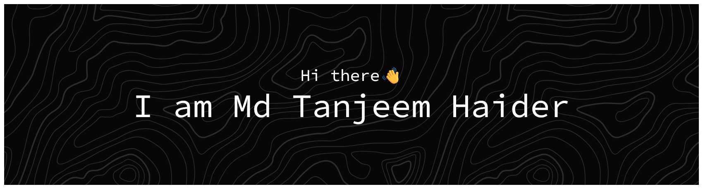
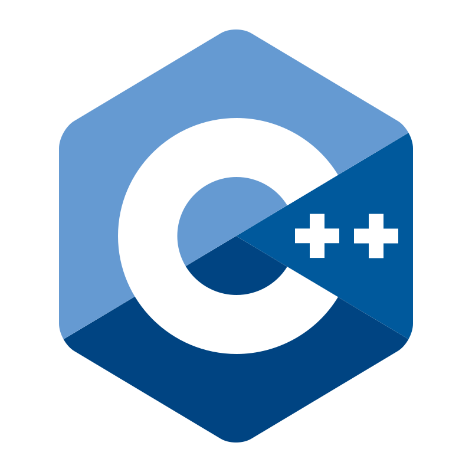

<!-- Align all to center -->

  <!-- Header Banner -->
  <picture>
    <source media="(prefers-color-scheme: dark)" srcset="./resources/banner-dark.png">
    <source media="(prefers-color-scheme: light)" srcset="./resources/banner-light.png">
    
  </picture>

  <!-- Badges -->
  

    
    
    
  

  <h3>🛠️ Languages & Technologies 🛠️</h3>
  <!-- Divider -->
  <picture>
    <source media="(prefers-color-scheme: dark)" srcset="./resources/divider-dark.svg">
    <source media="(prefers-color-scheme: light)" srcset="./resources/divider-light.svg">
    
  </picture>

  <!-- Skill table -->
  

  <!--
  --><!--
  --><!--
  --><!--
  --><!--
  --><!--
  --><!--
  --><!--
  --><!--
  --><!--
  -->
  <a href="https://flask.palletsprojects.com/" target="_blank">
      <picture>
          <source media="(prefers-color-scheme: dark)" srcset="./resources/icons/flask-dark.svg" width="50">
          <source media="(prefers-color-scheme: light)" srcset="./resources/icons/flask-light.svg" width="50">
          
      </picture>
  </a>
  

  <i>..and many more, but these are a mix of my strongest skills and personal favorites</i>

  <!-- Contribution Snake -->
  <picture>
    <source media="(prefers-color-scheme: dark)" srcset="./resources/github-contribution-grid-snake-dark.svg">
    <source media="(prefers-color-scheme: light)" srcset="./resources/github-contribution-grid-snake-light.svg">
    
  </picture>

